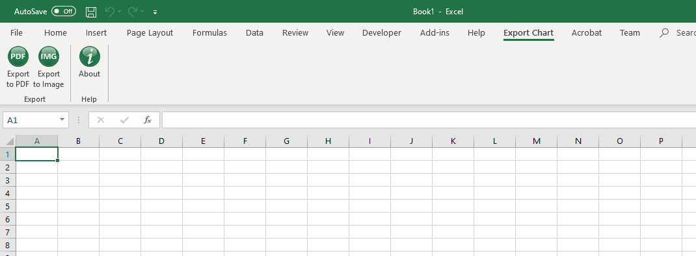

# ExportChart_Excel_Add-in
A MS Excel VSTO add-in to export charts as PDF and image files and crop the extra margins.

**Instructions:**
1. Download [setup_v1.0.0.0.zip](setup_v1.0.0.0.zip) and run the setup file.
2. With a chart selected in Excel, click on *Export to PDF* or *Export to Image* buttons from the *Export Chart* tab.

**Checksum of *setup_v1.0.0.0.zip*:**
- MD5: CF5A3F40F0266E3B0D90B6C87E01584F
- SHA1: 00AE882CA508A165A6F45C43E7286E1354B3AF10

**Supported output formats:** PDF, JPEG, PNG, BMP, TIFF

**Requirements:**
- A Windows version of Microsoft Office

**Tested on:** 
- Microsoft Excel 16 Build 11929 on Windows 10 64-bit

Please let me know if the add-in worked on a different version or if you had difficulties installing it.

**Screenshot:**

